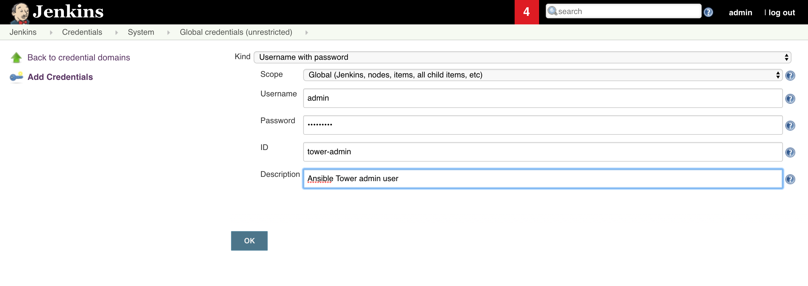

# ACME Beer Catalog Workshop Setup

## Prerequisites

* Each attendee / group of attendees should have a laptop running Lunix / Mac OS X or having access to a Linux terminal
* Internet access with no blacklist filtering on `*.apicurio.io`, `*.github.com`, `*.githubusercontent.com`, `*.getpostman.com`
* Ability to install Postman client tool on laptop
* Ability to install OpenShift client tool (`oc`) on laptop or remote machine
* Ability to install system utilities (`curl`, `git`, `sed`, `jq`) on laptop or remote machine
* An OpenShift cluster with enough resources for instantiating ~15 pods using 3 GB RAM per attendee / group of attendees

## System utilities setup

### On Linux
Depending on your distribution, you should be able to install `jq` through your package manager.

On Ubuntu / Debian : `sudo apt-get install jq`
On Fedora : `sudo dnf install jq`
On RHEL/CentOS :
```sh
$ yum install epel-release -y
$ yum install jq -y
```

On other distros, as jq has no runtime dependencies, you may just use :
```sh
$ wget -O jq https://github.com/stedolan/jq/releases/download/jq-1.5/jq-linux64
$ chmod +x ./jq
$ cp jq /usr/bin
```

### On Mac OS X

The easiest path is to install missing parts using Homebrew. If Homebrew not present on your laptop, just run the following command :
```sh
$ usr/bin/ruby -e "$(curl -fsSL https://raw.githubusercontent.com/Homebrew/install/master/install)"
```

Then, when Homebrew is setup, just run this command to install jq (everything else should just be already there) :
```sh
$ brew install jq
```

### Pre-Lab Setup

## Ansible Tower setup

In a transversal project that may be accessible to each attendee / group of attendees, instantiate an Ansible Tower. This setup should be done before the lab. It will require ansible command line (`brew install ansible` or `yum install ansible`)

### 1/ Prepare a Persistent Volume Claim

Once logged in your target projet:

```sh
$ oc apply -f - <<EOF
apiVersion: "v1"
kind: "PersistentVolumeClaim"
metadata:
  name: "postgresql"
spec:
  accessModes:
    - "ReadWriteOnce"
  resources:
    requests:
      storage: "5Gi"
EOF
```

### 2/ Clone the Git repositoriesfor

Retrieve community AWX and associated logos

```sh
$ git clone -b 1.0.6 https://github.com/ansible/awx.git
$ git clone https://github.com/ansible/awx-logos.git
```

### 3/ Run the install playbook

Provide `<project>`, `<master_host>` (without `https://` pragma), `<openshift_admin>`, `<openshift_admin_pwd>` as well as AWX admin and password :

```sh
$ cd awx/installer/
$ ansible-playbook -i inventory install.yml -e dockerhub_version=1.0.6 \
   -e openshift_host=<master_host> -e openshift_skip_tls_verify=true \
   -e openshift_project=<project> -e openshift_user=<openshift_admin> \
   -e openshift_password=<openshift_admin_pwd> -e default_admin_user=admin \
   -e default_admin_password=redhat123 -e awx_official=true
```

Example on a local Red Hat Container Development Kit (CDK), deploying into project named `fabric`:

```sh
$ ansible-playbook -i inventory install.yml -e dockerhub_version=1.0.6 \
    -e openshift_host=192.168.99.100:8443 -e openshift_skip_tls_verify=true \
    -e openshift_project=fabric -e openshift_user=admin \
    -e openshift_password=admin -e default_admin_user=admin \
    -e default_admin_password=mypassword123 -e awx_official=true
```

> Note: Ansible Tower containers requested resources may be considered a little high for a simple workshop. You may to lower them if you're resources constraint, in particular if using CDK. You may edit DeployConfig and lower them.

Wait for deployment to be finished.

### 4/ Concfigurer projet and job in AWC

Login on AWX with user you just created, go to the *Projects* section and add a new project with following properties :
* Name: `Deploy API to 3scale`
* Description: `Enable continuous deployment of an API to 3scale AMP`
* Organization: `default`
* SCM Type: `Git`
* SCM URL: `https://github.com/nmasse-itix/threescale-cicd-awx`
* SCM Branch/Tag/Commit: `master`

You can also tick `Update Revision on Launch` and setup a cache timeout.

Then you have to add a new *Job Template* with following properties :
* Name: `Deploy an API to 3scale`
* Project: `Deploy API to 3scale`
* Playbook: `deploy-api.yml`
* Inventory: `Prompt on Launch`
* Extra-variables: `Prompt on Launch`


## Microcks setup

This section may be run for each attendee / group of attendees if you have decided going that way.

### 1/ Create a new project holding Microcks stuffs for user

```sh
$ oc new-project microcks --display-name="Microcks"
```

### 2/ Register Microcks template within project

```sh
$ oc create -f https://raw.githubusercontent.com/microcks/microcks/master/install/openshift/openshift-persistent-full-template.yml -n microcks
```

### 3/ Instantiate template, deploying Microcks

The command below should be run by a cluster administrator because it requires to create an OAuthClient in OpenShift. In the command below, replace the variables by your values:
* `<project>` : name of project where setup is done. Here microcks.
* `<master_url>` : the HTTPS URL of OpenShift master
* `<app_host_url>` : the Host for Routes, ex `192.168.99.100.nip.io` when using CDK or Minishift.

```sh
$ oc new-app --template=microcks-persistent --param=APP_ROUTE_HOSTNAME=microcks-<project>.<app_host_url> --param=KEYCLOAK_ROUTE_HOSTNAME=keycloak-<project>.<app_host_url> --param=OPENSHIFT_MASTER=<master_url> --param=OPENSHIFT_OAUTH_CLIENT_NAME=<project>-client
```

### 4/ Create a Jenkins Master image containing Mcirocks plugin

```sh
$ oc process -f https://raw.githubusercontent.com/microcks/microcks-jenkins-plugin/master/openshift-jenkins-master-bc.yml | oc create -f -
```

Wait for build to finish.

### 5/ Deploy a Jenkins instance with this custom Master image

```sh
$ oc new-app --template=jenkins-persistent --param=NAMESPACE=microcks --param=JENKINS_IMAGE_STREAM_TAG=microcks-jenkins-master:latest
```

Wait for deployment to finish before getting on next step. When going to *Overview* of your OpenShift project, you should get the following pods running:


## Jenkins setup for Ansible Tower

Once Jenkins instance has been setup in previous step, you finally need to configure the connection between Jenkins and Ansible Tower. To do this, go to Jenkins, click on *Manage Jenkins* > *Manage Plugins* and install the `Ansible Tower` plugin.

Then click on *Credentials* > *System*, click on *Global credentials (unrestricted)* and select *Add Credentials...* . Fill-in your Tower Admin login and password, and choose `tower-admin` for the id field.




## OpenShift for running Workshop

Create a bunch of users (from `user01` to `user10` for example) so that they will be autohrized to authenticate and create projects if you plan to let them do that. See [Variants in overview](./README.md)).
